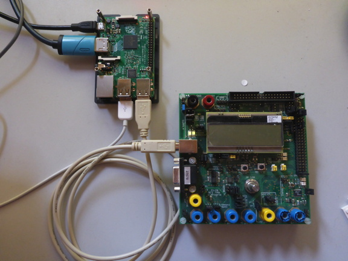
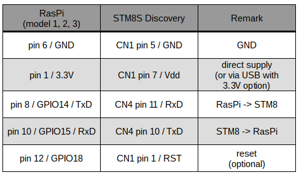
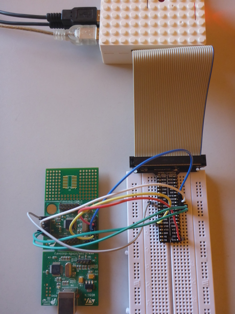
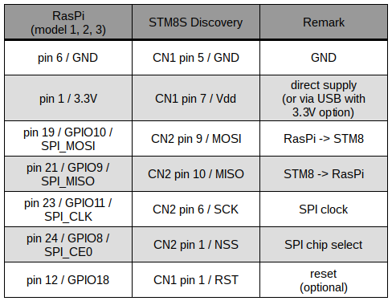
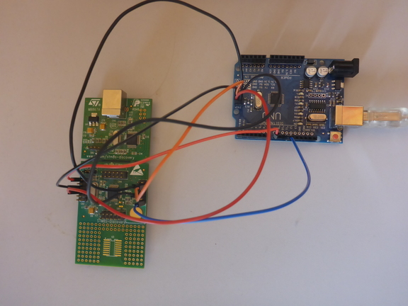
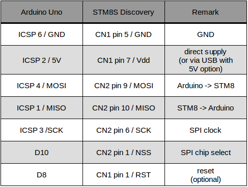
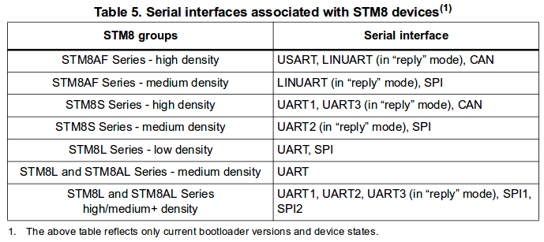
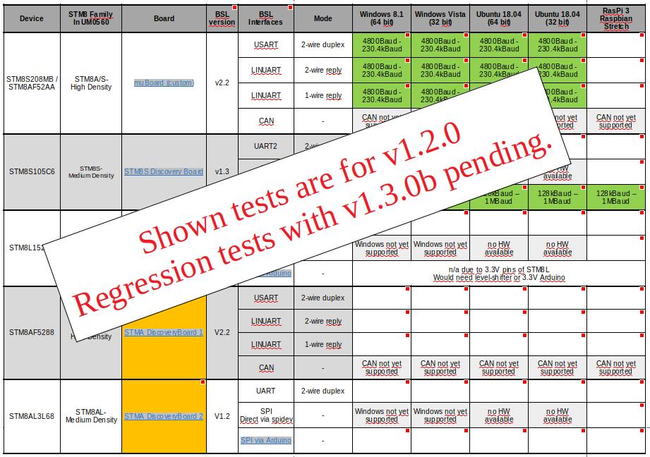

# Overview

_stm8gal_ is an application for programming or reading out [STM8](http://www.st.com/en/microcontrollers/stm8-8-bit-mcus.html) memory using the built-in ROM bootloader (BSL) via UART or SPI interface. It is compatible with Windows, MacOS X and Linux, including Raspbian. For a list of tested configurations see section [Test Overview](#test-overview).

Note: [_stm8gal_](https://github.com/gicking/stm8gal) replaces the [_STM8_serial_flasher_](https://github.com/gicking/STM8_serial_flasher). The latter was renamed after a [proposal by Philipp Krause](https://github.com/gicking/STM8_serial_flasher/issues/10)

Tools with similar functionality via the UART interface are:
- [_Flash Loader Demonstrator (UM0462)_](http://www.st.com/content/st_com/en/products/development-tools/software-development-tools/stm8-software-development-tools/stm8-programmers/flasher-stm8.html) by STM (proprietary, Windows only)
- [_stm8flasher_](http://sourceforge.net/p/oggstreamer/stm8flasher) by ottinger (open-source, Windows & Linux)
- [_stm-serial-flasher_](https://github.com/Gamadril/stm-serial-flasher) by gamadril (open-source, Chrome)

For bug reports or feature requests please send me a note.

Have fun!
Georg

***

# License / Disclaimer
- _stm8gal_ and it's source code is distributed under the Apache License Version 2.0 (see [License](LICENSE))

- exception is some RAM code, which is required for flash programming. This code is available on the [STM Homepage](http://www.st.com/web/catalog/tools/FM147/CL1794/SC1807/SS1754/PF258008). All rights to this RAM code remain with STM under the provided, proprietary license.

***

# Building the Software

The majority of _stm8gal_ is written in ISO C 99 with some OS-specific routines required e.g. for serial communication. However the required serial libs are part of all standard compiler suites and shouldn't pose a compatibility issue. In case of portability issues please contact the author for support.

Exceptions are

- [wiringPi](http://wiringpi.com/) library, which is [Raspberry Pi](https://www.raspberrypi.org/) specific, and allows automatic reset of the STM8 via GPIO header pin. Is pre-installed for Raspbian Stretch and above. To activate remove comment in Makefile

- [spidev](https://www.kernel.org/doc/Documentation/spi/spidev) kernel library for interfacing to the SPI. To activate remove comment in Makefile. The [Raspberry Pi](https://www.raspberrypi.org/) and other "embedded PCs" provide direct SPI pin access, so no extra hardware is required. For "normal" PCs, an extra hardware and likely an adaptation of the SPI send/receive routines is required (volunteers?) 

A code reference can be generated by running [Doxygen](http://www.doxygen.org) with input file 'Doxyfile'. Then open file './doxygen/html/index.html' with a webbrowser. For other output formats, e.g. PDF, modify 'Doxyfile' accordingly.

***

## Linux

Use one of the following options to build _stm8gal_:
- Open a terminal and change to the project directory. Then type `make`
- Alternatively double-click file "\_compile.sh". May require execute permissions via `chmod u+x *.sh`
- Open file "stm8gal.geany" with [Geany](https://www.geany.org/) and press "Make" (Shift+F9)
- for SPI communication via supported SPI adapter (untested!):
  - requires installed `spidev` and user access to SPI hardware
  - specify `CFLAGS += -DUSE\_SPIDEV` and `SOURCES += spi\_spidev\_comm.c` in file "Makefile"

Note: Under Linux access to serial ports may be prohibited. To grant access rights see [here](https://bugs.launchpad.net/ubuntu/+source/gtkterm/+bug/949597)

***

## Raspberry Pi

Same as Linux above, but with additional option:
- for reset STM8 via GPIO header:
  - specify `-DUSE\_WIRING` and `-lwiringPi` in file "Makefile"
  - if required install [wiringPi](http://wiringpi.com/). To check type `gpio readall` in commandline
  - enable GPIO access via `raspi-config`
  - add user to group gpio (`sudo usermod -a -G gpio $(whoami)`)
- for UART communication via GPIO header:
  - enable serial interface access via `raspi-config`
  - add user to group dialout (`sudo usermod -a -G dialout $(whoami)`)
- for SPI communication via GPIO header:
  - install spidev if required (is pre-installed for Raspbian Stretch and above)
  - specify `CFLAGS += -DUSE\_SPIDEV` and `SOURCES += spi\_spidev\_comm.c` in file "Makefile"
  - enable SPI access via `raspi-config`
  - add user to group spi (`sudo usermod -a -G spi $(whoami)`)
 
***

## Windows

Use one of the following options to build _stm8gal_:
- open file "stm8gal.dev" with [DevC++](http://sourceforge.net/projects/orwelldevcpp/) and press "Execute/Rebuild all" (F12)
- double-click file "\_compile.bat". Requires gcc and mingw32-make to be installed and in PATH. May require some modifications to the batchfile and file Makefile

Note: Windows commandline (cmd.exe) requires a path on a mounted drive, i.e. path to the tool has to start with 'C:\', 'D:\' or similar. So either copy the tool to a mounted drive or use 'connect network drive' to assign a drive letter. This limitation does not apply to POSIX operating systems

***

## MacOSX

Same as for Linux above. However, for double-click rename files "*.sh" to "*.command"
 
Note: Due to lack of a Macintosh, compatibility with MacOSX is no longer tested. Therefore, please provide feedback if you have experience with _stm8gal_ on a Mac. Also a Mac binary for distribution is highly appreciated. Thanks! 
 
***

# Using the Software

_stm8gal_ is a commandline tool without graphical interface (volunteers...?). The application is called from the command line or via shell script using the following syntax:

`stm8gal [-h] [-i interface] [-p port] [-b rate] [-u mode] [-R ch] [-e] [-w infile] [-x] [-v] [-r start stop outfile] [-j] [-V verbose] [-B] [-q]`

    -h                     print this help
    -i interface           communication interface: 0=UART, 1=SPI via spidev, 2=SPI via Arduino (default: UART)
    -p port                name of communication port (default: list available ports)
    -b rate                communication baudrate in Baud (default: 115200)
    -u mode                UART mode: 0=duplex, 1=1-wire, 2=2-wire reply, other=auto-detect (default: auto-detect)
    -R ch                  reset STM8: 0=skip, 1=manual, 2=DTR line (RS232), 3=send 'Re5eT!' @ 115.2kBaud, 4=Arduino pin 8, 5=Raspi pin 12 (default: manual)
    -e                     erase P-flash and D-flash prior to upload (default: skip)
    -w infile              upload s19 or intel-hex file to flash (default: skip)
      -x                   don't enable ROM bootloader after upload (default: enable)
      -v                   don't verify code in flash after upload (default: verify)
    -r start stop outfile  read memory range (in hex) to s19 file or table (default: skip)
    -j                     don't jump to flash before exit (default: jump to flash)
    -V                     verbosity level 0..2 (default: 2)
    -B                     optimize for background operation, e.g. skip prompts and colors (default: interactive use)
    -q                     prompt for <return> prior to exit (default: no prompt)

***

## Examples 

### Program custom [_muBoard_](https://frosch.piandmore.de/en/pam9/call/public-media/event_media/160611_Vortrag_Interpreter.pdf) via USB with manual reset

1. supply the [_muBoard_](https://frosch.piandmore.de/en/pam9/call/public-media/event_media/160611_Vortrag_Interpreter.pdf) via USB from the PC, here a RasPi. This also establishes the USB<->UART connection via an on-board [FT232](http://www.ftdichip.com/Products/ICs/FT232R.htm) adapter
 
2. note name of serial port, e.g. COM10 (Win) or /dev/ttyUSB0 (Linux). Hint: launching _stm8gal_ without argument lists the available ports

 
  

3. software usage:

   -`stm8gal -p /dev/ttyUSB0 -w main.ihx`   (Linux)
   
   -`stm8gal -p COM10 -w main.ihx`          (Windows)

***

### Program [STM8S Discovery Board](http://www.st.com/en/evaluation-tools/stm8s-discovery.html) via UART pins from [Raspberry Pi](https://www.raspberrypi.org/) with reset via GPIO

1. connect the [STM8S Discovery Board](http://www.st.com/en/evaluation-tools/stm8s-discovery.html) to the [Raspberry Pi](https://www.raspberrypi.org/) in the same sequence as shown below. Notes:
   - configure STM8S Discovery for 3.3V supply to avoid damage to the Raspberry Pi 3.3V GPIOs 
   - for direct GPIO and UART access [add user to groups 'gpio' and 'dialout'](#raspberry-pi)
   - in addition, reset via header pin requires [wiringPi installed with user access](#raspberry-pi)
   - for pinning of the Raspberry Pi GPIO header type "[gpio readall](http://wiringpi.com/the-gpio-utility/)" on the command line, or see e.g. [here](https://pinout.xyz)
 

 
  

 
  

2. software usage:

   -`stm8gal -p /dev/ttyAMA0 -w main.ihx -R 3`   (RasPi 1+2)
   
   -`stm8gal -p /dev/serial0 -w main.ihx -R 3`   (RasPi 3)

***

### Program [STM8S Discovery Board](http://www.st.com/en/evaluation-tools/stm8s-discovery.html) via SPI pins from [Raspberry Pi](https://www.raspberrypi.org/) using spidev with reset via GPIO

1. connect the [STM8S Discovery Board](http://www.st.com/en/evaluation-tools/stm8s-discovery.html) to the [Raspberry Pi](https://www.raspberrypi.org/) in the same sequence as shown below. Notes:
   - configure STM8S Discovery for 3.3V supply to avoid damage to the Raspberry Pi 3.3V GPIOs 
   - for direct GPIO and SPI access [add user to groups 'gpio' and 'spi'](#raspberry-pi)
   - in addition, reset via header pin requires [wiringPi installed with user access](#raspberry-pi)
   - for pinning of the Raspberry Pi GPIO header type "[gpio readall](http://wiringpi.com/the-gpio-utility/)" on the command line, or see e.g. [here](https://pinout.xyz)
 

 
  

 
  

2. software usage:

   -`stm8gal -i 1 -p /dev/spidev0.0 -w main.ihx -R 3`

***

### Program [STM8S Discovery Board](http://www.st.com/en/evaluation-tools/stm8s-discovery.html) via [Arduino SPI bridge](https://github.com/gicking/Arduino_SPI_bridge) and reset via GPIO

1. Supply the [Arduino](https://www.arduino.cc) to the PC via USB. This also establishes an USB connection to the on-board microcontroller.

2. Program the Arduino to act an an USB<->SPI bridge using [this](https://github.com/gicking/Arduino_SPI_bridge) software. Note that this software is currently only compatible with Atmega boards, i.e. **requires 5V GPIOs**

3. Note name of serial port, e.g. COM10 (Win) or /dev/ttyUSB0 (Linux). Hint: launching _stm8gal_ without argument lists the available ports

4. connect the [STM8S Discovery Board](http://www.st.com/en/evaluation-tools/stm8s-discovery.html) to the Arduino in the same sequence as shown below. Notes:
   - configure STM8S Discovery for 5V supply to avoid damage to its GPIOs 
 

 
  

 
  

2. software usage:

   -`stm8gal -i 2 -p /dev/ttyUSB0 -w main.ihx -R 4`

***

### Memory dump [_muBoard_](https://frosch.piandmore.de/en/pam9/call/public-media/event_media/160611_Vortrag_Interpreter.pdf) via USB with manual reset

1. supply the [_muBoard_](https://frosch.piandmore.de/en/pam9/call/public-media/event_media/160611_Vortrag_Interpreter.pdf) via USB from the PC, here a RasPi. This also establishes the USB<->UART connection via an on-board [FT232](http://www.ftdichip.com/Products/ICs/FT232R.htm) adapter
  
2. note name of serial port, e.g. COM10 (Win) or /dev/ttyUSB0 (Linux). Hint: launching _stm8gal_ without argument lists the available ports

 
  

3. software usage:

   -`stm8gal -p /dev/ttyUSB0 -r 0x8000 0x8FFF dump.s19`   (Linux, Motorola S19 format)
   
   -`stm8gal -p /dev/ttyUSB0 -r 0x8000 0x8FFF dump.txt`   (Linux, table format)
   
   -`stm8gal -p COM10 -r 0x8000 0x8FFF dump.s19`   (Windows, Motorola S19 format)

***

# General Notes

- bootloader programming via UART, SPI or CAN is supported by most STM8 devices. However, not all devices support each interface. A full description of the bootloaders can be found in [UM0560](http://www.st.com/st-web-ui/static/active/en/resource/technical/document/user_manual/CD00201192.pdf), including an overview of STM8 devices with respective bootloader mode. For version >=1.2.0 the UART mode can optionally be auto-detected by _stm8gal_:

 
  

- To program via _stm8gal_, communication between PC and STM8 must be possible. On the STM8 side this is via [UART](https://en.wikipedia.org/wiki/UART) or [SPI](https://en.wikipedia.org/wiki/Serial_Peripheral_Interface_Bus), on the PC side this is generally via USB or RS232.

  - On some boards, e.g. the custom [_muBoard_](https://frosch.piandmore.de/en/pam9/call/public-media/event_media/160611_Vortrag_Interpreter.pdf), an USB<->UART bridge is already present. In this case, no additional hardware is required
  
  - However, e.g. the popular [STM8S Discovery](http://www.st.com/en/evaluation-tools/stm8s-discovery.html) and [STM8L Discovery](http://www.st.com/en/evaluation-tools/stm8l-discovery.html) boards connect to a standard PC via SWIM (=debug) interface. In this case a separate adapter is required to connect to the respective STM8 UART or SPI pins, e.g. [UM232R](http://de.farnell.com/ftdi/um232r/evaluationskit-usb-uart-ttl-ft232rl/dp/1146036?ost=UM232R). When connecting, make sure that the voltage levels of STM8 and the adapter are compatible. **Exposing a 3.3V device to 5V signals may damage the 3.3V device**.

  - Exception is the [Raspberry Pi](https://www.raspberrypi.org) or similar “embedded PCs“ with direct access to UART and SPI pins via the GPIO header. In this case make sure that the voltage levels of STM8 and embedded PC are compatible, e.g. for RasPi with 3.3V pins also supply the STM8 with Vdd=3.3V. As noted above, **never expose a 3.3V device to 5V signals**.

  - Alternatively an [Arduino](https://www.arduino.cc) can be used to act as a USB<->SPI bridge using a dedicated "gateway software". For the Arduino project and a technical documentation see the [Arduino SPI_bridge](https://github.com/gicking/Arduino_SPI_bridge) repository.

- Prior to uploading code via _stm8gal_ the STM8 ROM bootloader needs to be activated via option bytes. For details see the respective STM8 device datasheet. If required, change the option bytes via SWIM debug interface using

  - [ST Visual Programmer](http://www.st.com/web/en/catalog/tools/FM147/CL1794/SC961/SS1533/PF210568?s_searchtype=keyword) application by STM (proprietary, Windows only)

  - [stm8flash](https://github.com/vdudouyt/stm8flash) by Valentin Dudouyt to upload and run the STM8 program in subfolder './BSL_activate'

  - Notes
   
    - Virgin devices (i.e. flash completely erased) automatically have the bootloader enabled 

    - _stm8gal_ by default activates the BSL after upload (see section [Using the Software](#using-the-software)) 

- The BSL can be entered only within 1s after reset or power-on. Exception are virgin devices, which remain in bootloader mode indefinitely.

- The UART "reply" mode (see above) supports single-wire interfaces like LIN or ISO9141. It requires a "Rx echo" for each sent byte. Using the reply mode with dual wires therefore requires _stm8gal_ to echo each received byte individually, which results in low upload speeds. Also "reply" seems to work reliably only up to 115.2kBaud.

- The STM32 uses a very similar bootloader protocol, so adapting the flasher tool for STM32 should be straightforward. However, I have no board available, but please feel free to go ahead...

***

# Test Overview

_stm8gal_ has recently been tested only for the below STM8 devices and operating systems. Theoretically it should work for all STM8 devices with bootloader, especially since STM8AF, STLUX, STNRG and STM8SPLNB seem to be test variants of the STM8S, and STM8AL and STM8T seem to be test variants of the STM8L. However, this has not been tested, so if you use _stm8gal_ in another setup, any feedback is highly appreciated! 

 
  

***

# Limitations

- SPI verify after write does not work (READ command only returns ACK) -> verify after write is disabled for SPI. Strangely, memory read-out works via SPI

- On RasPi 3 SPI communication via spidev works reliably only up to 250kBaud. With Arduino and setup above, upload is ok up to 2MBaud

- UART reply mode seems to work reliably only up to 115.2kBaud

***

# Revision History

v1.2.0b (2018-12-02)
  - add automatic UART mode detection (duplex, 1-wire, 2-wire reply). See [UART mode issue](https://github.com/gicking/stm8gal/issues/7)
  - changed default UART baudrate to 115.2kBaud due to 1-wire speed limitation (see [Limitations](#limitations))

----------------

v1.1.8 (2018-10-07)
  - add option for background operation for IDE usage. Skip prompts and setting console color & title
  - add different verbosity levels (0..2) for IDE usage

----------------

v1.1.7 (2018-01-04)
  - added option to skip reset (-R 0) via commandline
  - reset STM8 before opening port to avoid [flushing issue under Linux](https://stackoverflow.com/questions/13013387/clearing-the-serial-ports-buffer)

----------------

v1.1.6 (2017-12-22)
  - fixed bug in SPI using [Arduino bridge](https://github.com/gicking/Arduino_SPI_bridge)

----------------

v1.1.5 (2017-12-20)
  - added SPI support via [Arduino bridge](https://github.com/gicking/Arduino_SPI_bridge)
  - replace manual reset parameter "-Q" with "-R 0"
  - fixed bug in "2-wire reply mode" (wrong echo)

----------------

v1.1.4 (2017-12-14)
  - added SPI support via spidev (currently only POSIX)
  - add user-space access to RasPi GPIOs via wiringPi for automatic reset. Use header numbering scheme (="physical")
  - removed verbose commandline option (-V). Always print verbose 
  - added listing of /dev/serial0 (new in Pi3, see https://raspberrypi.stackexchange.com/questions/45570/how-do-i-make-serial-work-on-the-raspberry-pi3)

----------------

v1.1.3 (2017-08-29)
  - renamed from "STM8_serial_flasher" to "stm8gal", following a proposal by Philipp Krause (see https://github.com/gicking/STM8_serial_flasher/issues/10)

----------------

v1.1.2 (2016-05-25)
  - add optional flash mass erase prior to upload

----------------

v1.1.1 (2016-02-03):
  - add support for STM8L family (skip RAM code upload)
  - add memory dump to file

----------------

v1.1.0 (2015-06-22):
  - add support for STM8 bootloader “reply mode“
  - add optional reset of STM8 via DTR (RS232/USB) or GPIO18 (Raspberry)

----------------

v1.0.0 (2014-12-21):
  - initial release by Georg Icking-Konert under the Apache License 2.0

